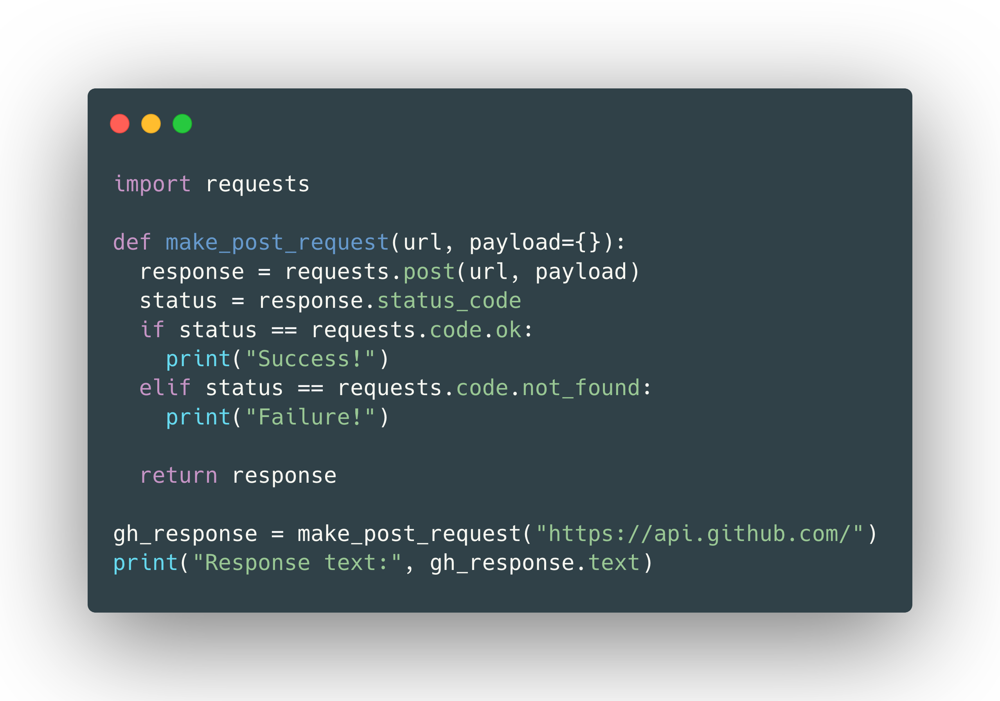

<h1 align="center">
  
  <br />
</h1>

`saplings` is a static analysis tool for Python. It can map out the API of an imported module based only on its usage in a program. The API is represented as a dependency tree, where each node is a construct in the module.

<h1 align="center" display="flex" justify-content="center">
  
  
</h1>

<!-- This library also provides simple methods for calculating software metrics, including:

- Halstead Metrics (Volume, Difficulty, Estimated Length, etc.)
- Afferent and Efferent Couplings
- Abstractness
- Instability
- Function Rankings
- # of Partial, Recursive, and Curried Functions
- # of Lines of Code
- Cyclomatic Complexity (COMING SOON)
- Maintainability Index (COMING SOON) -->

## Installation

> Requires Python 3.0 or higher.

You can download a compiled binary [here](https://github.com/shobrook/saplings/releases) or install `saplings` with pip:

`$ pip install saplings`

## Quick Start

Import the `Saplings` object and initialize it with the root node of an AST (you'll need the `ast` module for this).

```python
import ast
from saplings import Saplings

my_program = open("path_to_your_program.py", "r").read()
program_ast = ast.parse(my_program)
my_saplings = Saplings(program_ast)
```

Initializing `Saplings` does ...

Here's how to print out the d-trees, save them as JSON, etc. ...

## Guide

### Functions

Recursive and curried functions are handled. Closures too.

## Limitations

### Control Flow

Handling control flow is tricky. Tracking the usage of a module in `if`, `try`/`except`, `for`, `while`, and `with` blocks requires making assumptions about what code will run. For example, consider the following program:

```python
import module

for item in module.items():
  print(item.foo())
```

If `module.items()` is an empty list, then `item.foo()` will never be called. In that situation, adding the `__index__ -> () -> foo -> ()` subtree to `module -> items -> ()` would be an example of a false positive. To handle this, `Saplings` _should_ produce two possible trees for this module (see issue #X): `module -> items -> ()` and `module -> items -> () -> __index__ -> () -> foo -> ()`. But as of right now,
`Saplings` will only produce the latter tree –– that is, we assume the bodies of `for` loops are always executed. Here are some other assumptions that `Saplings` makes:

#### `If` and `IfExp`

Assignments made in the first `If` block in a series of `If`s, `Elif`s, and `Else`s are assumed to be the only assignments that persist. For example, consider this code and its corresponding d-tree:

```python
import module

var1 = module.foo()
var2 = module.bar()

if condition:
  var1 = module.attr1 # Type I
  var2 = None # Type II
else:
  var1 = None
  var2 = module.attr2

var1.fizzle()
var2.shizzle()
```

```
module (1)
 +-- foo
 |   +-- () (1)
 +-- bar
 |   +-- () (1)
 +-- attr1 (1)
 |   +-- fizzle
 |       +-- () (1)
 +-- attr2 (1)
```

Notice that our assumption can produce false positives and negatives. If it turns out the `Else` block executes and not the `If`, then `attr1 -> fizzle -> ()` would be a false positive and the lack of inclusion of `attr2 -> shizzle -> ()` would be a false negative.

This assumption applies to `IfExp`s too. For example, the assignment `var = module.foo() if condition else module.bar()` is equivalent to `var = module.foo()`.

#### `While`

`while` loops are processed under the same assumption as `for` loops –– that is, the body of the loop is assumed to execute.

#### `Try`, `Except`, and `Finally`

#### `Pass`

#### `Continue`

```python
import module

for item in module.items():
  continue
  print(item.foo())
```

We assume that the code underneath the continue statement does not execute. But what if the `continue` statement is inside an `if` block?

#### ``

4. With
5. Continue
6. Break

`Saplings` can't handle generators and assignments to data structures.

#### `Saplings.analyze_module_usage(conservative=False, namespace={})`

This method uses some basic type inference to track the usage of an imported module. It then maps out all the used attributes of the module (functions, instances, types) as a dependency tree and assigns a frequency value to each node. In theory, if your program used every construct in a module, then this tree would represent its entire API. The tree is returned as a dictionary with the following structure:

<!--Give example of dictionary structure side-by-side with tree visualization-->

**Arguments**

- `conservative: Bool`: Because Python is a dynamic language, multiple module trees may be extracted for a single module, each corresponding to a possible execution path through the program. If set to `True`, GAT will only return a tree derived from code that is _sure_ to execute. If `False`, then multiple trees might be returned for each module. <!--Give example-->
  - Maximum # of dep. trees = Cyclomatic Complexity
- `namespace: Dict`: Lets you factor in the attributes of imported local modules.

**Limitations**

Notably, `analyze_module_usage` is not a type inference algorithm. For example, consider the following program:

```python
import torch

my_tensor = torch.tensor([1,2,3])
my_ndarray = my_tensor.numpy()
print(my_ndarray.dtype)
```

<!--Give visualization of tree-->

`analyze_module_usage` will _not_ tell you that calling `.numpy()` on a `tensor` returns an object of type `numpy.ndarray`. It will, however, tell you that `.numpy()` returns an object with a `dtype` attribute. <!--This is similar in principle to duck typing, where the attributes of an object are what define its type.-->

Another limitation is the lack of any formal proof that `analyze_module_usage` works correctly for every possible usage of a module. While it is able to follow complex paths through a program, I haven't tested every edge case, and there are already some known failure modes:

<!--List ways in which it fails-->
