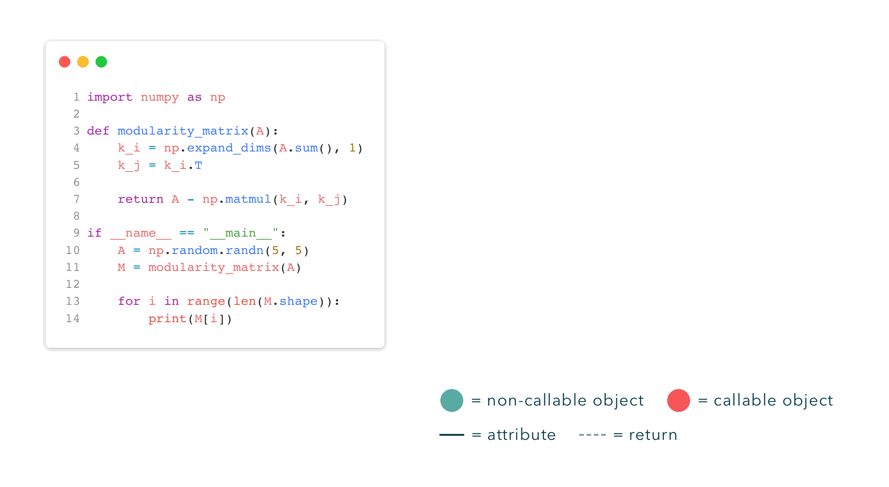

<h1 align="center">
  
  <br />
</h1>

`saplings` is a static analysis tool for Python. Given a program, `saplings` will build object hierarchies for every module imported in the program. These are dependency trees where the root node represents a module and each child represents a descendant attribute of that module. Object hierarchies are useful for making inferences about a module's API, mining patterns in how a module is used, and [duck typing](https://en.wikipedia.org/wiki/Duck_typing).



<!-- This library also provides simple methods for calculating software metrics, including:

- Halstead Metrics (Volume, Difficulty, Estimated Length, etc.)
- Afferent and Efferent Couplings
- Abstractness
- Instability
- Function Rankings
- # of Partial, Recursive, and Curried Functions
- # of Lines of Code
- Cyclomatic Complexity (COMING SOON)
- Maintainability Index (COMING SOON) -->

## Installation

> Requires Python 3.X.

You can install `saplings` with `pip`:

```bash
$ pip install saplings
```

## Usage

Using `saplings` takes only two steps. First, convert your input program into an [Abstract Syntax Tree (AST)](https://en.wikipedia.org/wiki/Abstract_syntax_tree) –– you'll need to import the `ast` module for this. Then, import the `Saplings` object and initialize it with the root node of the AST.

```python
import ast
from saplings import Saplings

my_program = open("path_to_your_program.py", "r").read()
program_ast = ast.parse(my_program)
my_saplings = Saplings(program_ast)
```

That's it. To access the object hierarchies, use the `trees` attribute of your `Saplings` object, like so:

```python
my_saplings.trees # => [ObjectNode(), ObjectNode(), ..., ObjectNode()]
```

For more advanced usage of the `Saplings` object, read the docstring [here]().

### Printing an Object Hierarchy

`trees` holds a list of `ObjectNode`s, each representing the root node of an object hierarchy. Each `ObjectNode` has the following attributes:
* **`name` _(str)_:** Name of the object
* **`is_callable` _(bool)_:** Whether the object is callable (i.e. has `__call__` defined)
* **`order` _(int)_:** Indicates the type of connection to the parent node (e.g. `0` is an attribute of the parent, `1` is an attribute of the output of the parent when called, etc.); `-1` if node is root
* **`children` _(list)_:** List of child nodes

To pretty-print a tree, simply pass its root node into the `render_tree` iterator, like so:

```python
from saplings.utilities import render_tree

for branches, node in render_tree(my_saplings.trees[0]):
  print(f"{branches}{node}")
```
```
numpy
 +-- random (NC, 0)
 |   +-- randn (C, 0)
 |       +-- __sub__ (C, 1)
 |       |   +-- shape (NC, 1)
 |       |   +-- __index__ (C, 1)
 |       +-- sum (C, 1)
 +-- matmul (C, 0)
 +-- expand_dims (C, 0)
     +-- T (NC, 1)
```

Here, `NC` means indicates a non-callable node and `C` indicates a callable node. `0` and `1` indicate the order of the node's connection to its parent.

To create a dictionary representation of a tree or multiple trees, pass the root nodes into the `dictify_trees` function, like so:

```python
from saplings.utilities import dictify_trees

forest_dict = dictify_trees(my_saplings.trees)
```
```python
{
  "numpy": {
    "is_callable": False,
    "order": -1,
    "children": [
      {"random": ...},
      {"matmul": ...},
      {"expand_dims": ...}
    ]
  }
}
```

### Understanding the Object Hierarchy

Each node is an _object_ and an object can either be _callable_ (i.e. has `__call__` defined) or _non-callable_. Connections between nodes each have an _order_ –– a number which describes the relationship between a node and its parent. If a node is a 0th-order child of its parent object, then it's an attribute of that object. If it's a 1st-order child, then it's an attribute of the output of the parent object when it's called. For example:

```python
my_parent = module.my_obj

my_parent.my_attr # my_attr is a 0th-order child of my_obj
my_parent().T # my_attr is a 1st-order child of my_obj
my_parent()().T # my_attr is a 2nd-order child of my_obj
```

#### What counts as a function?

Saplings works with a very "literal" definition of a function. Subscripts, comparisons, and binary operations are just syntactic sugar for function calls, and are represented in the tree as such. Here are some common "translations:"

```python
my_obj['my_sub'] # => my_obj.__index__('my_sub')
my_obj + 10 # => my_obj.__add__(10)
my_obj == None # => my_obj.__eq__(None)
```

## Limitations

Saplings _statically_ analyzes the usage of a module in a program, meaning it doesn't actually execute any code. Instead, it traverses the program's AST and tracks "object flow," i.e. how an object is passed through a program via assignments and calls of user-defined functions and classes. Consider this example of currying:

```python
import module

def compose(g, f):
    def h(x):
        return g(f(x))
    return h

def func1(t):
  return t.foo

def func2(t):
  return t.bar

composed_func = compose(func1, func2)
composed_func(module.var)
```

Saplings identifies `var` as an attribute of `module`, then follows the object as it's passed into `composed_func`. Because saplings has an understanding of how `composed_func` is defined, it can capture the `bar` and `foo` sub-attributes.

While saplings is able to track object flow through many complex paths in a program, I haven't tested every edge case, and there are some situations where saplings produces inaccurate trees. Here are all the failure modes I'm aware of (and currently working on fixing):

### Data Structures

As of right now, `saplings` can't track _assignments_ to comprehensions, generator expressions, dictionaries, lists, tuples, or sets. It can, however, track object flow _inside_ these data structures. For example, consider the following:

```python
import module

my_var = [module.foo(1), module.foo(2), module.foo(3)]
my_var[0].bar()
```

Here, `bar` would not be captured and added to the `module` hierarchy, but `foo` would.

### Control Flow

Handling control flow is tricky. Tracking object flow in loops and conditionals requires making assumptions about what code actually executes. For example, consider the following program:

```python
import module

for item in module.items():
  print(item.foo())
```

<!--Create visualization that demonstrates this?-->

If `module.items()` returns an empty list, then `item.foo` will never be called. In that situation, adding the `__index__ -> foo` subtree to `module -> items` would be a false positive. To handle this, saplings _should_ branch out and produce two possible trees for this module: `module -> items` and `module -> items -> __index__ -> foo`. But as of right now, saplings will only produce the latter tree –– that is, we assume the bodies of `for` loops are always executed.

#### `while` loops

`while` loops are processed under the same assumption as `for` loops –– that is, the body of the loop is assumed to execute.

#### `if`/`else` blocks

We assume the bodies of `if` blocks execute, and that `elif`/`else` blocks do not execute. That is, changes to the namespace made in the first `if` block in a series of `if`s, `elif`s, and/or `else`s are the only changes assumed to persist into the parent scope. For example, consider this code and the d-tree saplings produces:

```python
import module

var1 = module.foo()
var2 = module.bar()

if condition:
  var1 = module.attr1
  var2 = None
else:
  var1 = None
  var2 = module.attr2

var1.fizzle()
var2.shizzle()
```

```
module
 +-- foo
 +-- bar
 +-- attr1
 |   +-- fizzle
 +-- attr2
```

Notice that our assumption can produce false positives and negatives. If it turns out `condition` is `False` and the `else` block executes, then `attr1 -> fizzle` would be a false positive and the exclusion of `attr2 -> shizzle` would be a false negative. Ideally, saplings would branch out and produce two separate trees for this module –– one for when the `if` block executes and the other for when the `else` executes.

Our assumption applies to ternary expressions too. For example, the assignment `var = module.foo() if condition else module.bar()` is, under our assumption, equivalent to `var = module.foo()`.

#### `try`/`except` blocks

`try` blocks are assumed to always execute, and the `except` block is assumed not to execute. Like with `if`/`else` blocks, this assumption does not mean the `except` body is ignored. <!--Object flow-->Module usage is still tracked inside the `except` block, but changes to the namespace do not persist outside the block.

<!-- #### `continue` and `break` statements

If `continue` or `break` is used inside a loop, we assume the code underneath the statement does not execute. For example, consider this program:

```python
import module

for i in range(10):
  continue
  module.foo()
```

This isn't really a limitation, but we do ignore any module usage patterns in the code underneath `continue` statements, even if they are legitimate. Notably, our assumption will never produce any false positives. -->

#### `return`, `break`, and `continue` statements

All code underneath a `return`, `break`, or `continue` statement is assumed not to execute and will not be analyzed. This is not so much a limitation as it is an assumption, but it can produce some false negatives. For example:

```python
import module

for x in range(10):
  y = module.foo
  continue
  y.bar()
```

It may be the case that `bar` is an attribute of `module.foo`, but saplings will not capture this since `y.bar()` would never be executed, and therefore we cannot be sure it's a valid usage of the module.

### Functions

#### Conditional return types

`saplings` can generally track module and user-defined functions, but there are some edge cases it cannot handle. For example, because module functions must be treated as black-boxes to `saplings`, conditional return types cannot be accounted for. Consider this code and the hierarchy `saplings` produces:

```python
import module

module.foo(5).bar1()
module.foo(10).bar2()
```

```
module
 +-- foo
 |   +-- bar1
 |   +-- bar2
```

However, if `module.foo` is defined as:

```python
def foo(x):
  if x <= 5:
    return ObjectA()
  else:
    return ObjectB()
```

and `ObjectB` doesn't have `bar1` as an attribute, then
`saplings` will treat `bar1` and `bar2` as attributes of the same object.

#### Recursion

Saplings cannot process recursive function calls. Consider the following example:

```python
import module

def my_recursive_func(input):
  if input > 5:
    return my_recursive_func(input - 1)
  elif input > 1:
    return module.foo
  else:
    return module.bar

output = my_recursive_func(5)
output.attr()
```

We know this function returns `module.foo`, but Saplings cannot tell which base case is hit, and therefore cannot track the output. To avoid false positives, we assume this function returns nothing, and thus `attr` will not be captured and added to the object hierarchy.

#### Generators

For now, generators are ignored during  

#### Decorators

#### Single-Star Arguments

#### Anonymous Functions

### Miscellaneous

Code in `exec` statements is ignored. `nonlocals` is ignored. Star and double-star arguments.
