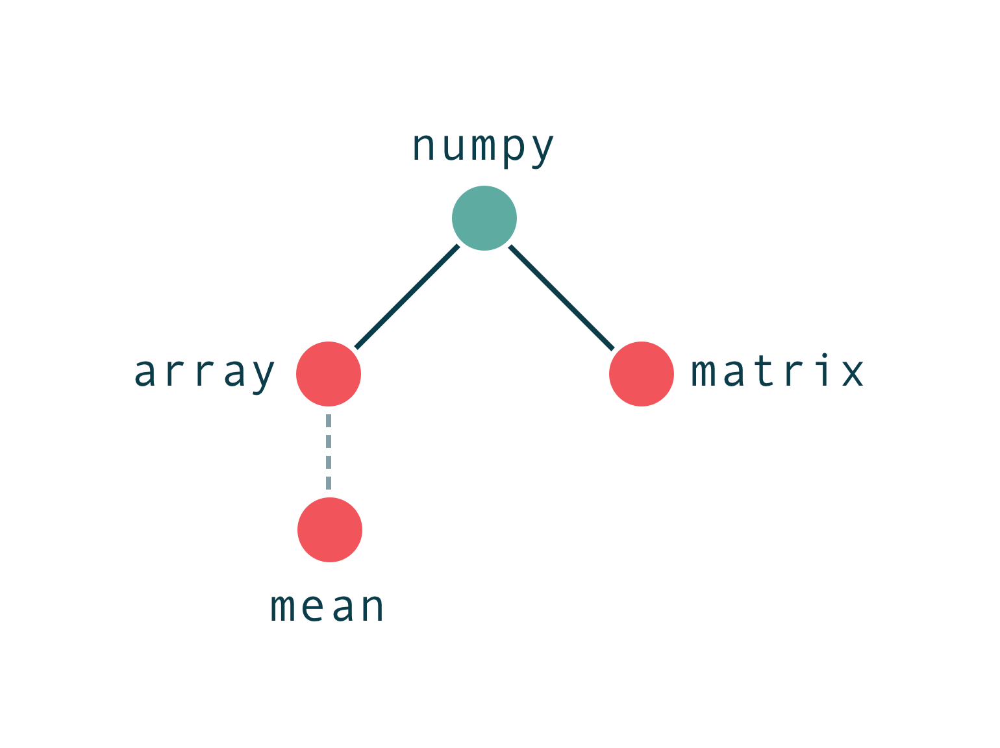

# syntaxis

> Note: this tool used to be called saplings but has sinced been renamed to syntaxis. [Saplings now refers to an LLM agent library.](https://github.com/shobrook/saplings)

`syntaxis` is a static analysis tool for Python. Given a program, `syntaxis` will build object hierarchies for every module imported in the program. Object hierarchies are dependency trees where the root node represents a module and each child represents an attribute of its parent. These can be useful for making inferences about a module's API, mining patterns in how a module is used, and [duck typing](https://en.wikipedia.org/wiki/Duck_typing).


<!-- This library also provides simple methods for calculating software metrics, including:

- Halstead Metrics (Volume, Difficulty, Estimated Length, etc.)
- Afferent and Efferent Couplings
- Abstractness
- Instability
- Function Rankings
- Cyclomatic Complexity
- Maintainability Index -->

## Installation

> Requires Python 3.X.

You can install `syntaxis` with `pip`:

```bash
$ pip install syntaxis
```

## Usage

Using syntaxis takes only two steps. First, convert your input program into an [Abstract Syntax Tree (AST)](https://en.wikipedia.org/wiki/Abstract_syntax_tree) using the `ast` module. Then, import the `Syntaxis` object and initialize it with the root node of the AST.

```python
import ast
from syntaxis import Syntaxis

my_program = open("path_to_your_program.py", "r").read()
program_ast = ast.parse(my_program)
my_syntaxis = Syntaxis(program_ast)
```

That's it. To access the object hierarchies, simply call the `get_trees` method in your `Syntaxis` object, like so:

```python
my_syntaxis.get_trees() # => [ObjectNode(), ObjectNode(), ..., ObjectNode()]
```

For more advanced usage of the `Syntaxis` object, read the docstring [here]().

### Printing an Object Hierarchy

`get_trees` returns a list of `ObjectNode`s, each representing the root node of an object hierarchy and which has the following attributes:
* **`name` _(str)_:** Name of the object
* **`is_callable` _(bool)_:** Whether the object is callable (i.e. has `__call__` defined)
* **`order` _(int)_:** Indicates the type of connection to the parent node (e.g. `0` is an attribute of the parent, `1` is an attribute of the output of the parent when called, etc.); `-1` if node is root
* **`frequency` _(int)_:** Number of times the object is used in the program
* **`children` _(list)_:** List of child nodes

To pretty-print a tree, simply pass its root node into the `render_tree` generator, like so:

```python
from syntaxis import render_tree

trees = my_syntaxis.get_trees()
root_node = trees[0]
for branches, node in render_tree(root_node):
  print(f"{branches}{node}")
```
```
numpy (NC, -1)
 +-- random (NC, 0)
 |   +-- randn (C, 0)
 |       +-- __sub__ (C, 1)
 |       |   +-- shape (NC, 1)
 |       |   +-- __index__ (C, 1)
 |       +-- sum (C, 1)
 +-- matmul (C, 0)
 +-- expand_dims (C, 0)
     +-- T (NC, 1)
```

(Here, `NC` means indicates a non-callable node and `C` a callable node. `-1`/`0`/`1` indicate the order of the node's connection to its parent).

To create a dictionary representation of a tree, pass its root node into the `dictify_tree` function, like so:

```python
from syntaxis import dictify_tree

dictify_tree(root_node)
```
```python
{
  "numpy": {
    "is_callable": False,
    "order": -1,
    "frequency": 1,
    "children": [
      {"random": ...},
      {"matmul": ...},
      {"expand_dims": ...}
    ]
  }
}
```

### Interpreting the Object Hierarchy

Each node is an _object_ and an object can either be _callable_ (i.e. has `__call__` defined) or _non-callable_. Links between nodes each have an _order_ –– a number which describes the relationship between a node and its parent. If a node is a 0th-order child of its parent object, then it's an attribute of that object. If it's a 1st-order child, then it's an attribute of the output of the parent object when it's called, and so on. For example:

```python
my_parent = module.my_obj

my_parent.attr # attr is a 0th-order child of my_obj
my_parent().attr # attr is a 1st-order child of my_obj
my_parent()().attr # attr is a 2nd-order child of my_obj
```

#### What counts as a function?

In Python, subscripts, comparisons, and binary operations are all just syntactic sugar for function calls, and are treated by syntaxis as such. Here are some common "translations:"

```python
my_obj['my_sub'] # => my_obj.__index__('my_sub')
my_obj + 10 # => my_obj.__add__(10)
my_obj == None # => my_obj.__eq__(None)
```

## Limitations

Syntaxis _[statically analyzes](https://en.wikipedia.org/wiki/Static_program_analysis)_ the usage of a module in a program, meaning it doesn't actually execute any code. Instead, it traverses the program's AST and tracks "object flow," i.e. how an object is passed through a program via variable assignments and calls of user-defined functions and classes. To demonstrate this idea, consider this example of [currying](https://en.wikipedia.org/wiki/Currying) and the tree syntaxis produces:

```python
import torch

def compose(g, f):
  def h(x):
    return g(f(x))

  return h

def F(x):
  return x.T

def G(x):
  return x.sum()

composed_func = compose(F, G)
composed_func(torch.tensor())
```

<p align="center">
  
</p>

Syntaxis identifies `tensor` as an attribute of `torch`, then follows the object as it's passed into `composed_func`. Because syntaxis has an understanding of how `composed_func` is defined, it can analyze the object flow within the function and capture the `T` and `sum` sub-attributes.

While syntaxis can track object flow through many complex paths in a program, I haven't tested every edge case, and there are some situations where syntaxis produces inaccurate trees. Below is a list of all the failure modes I'm aware of (and currently working on fixing). If you discover a bug or missing feature that isn't listed here, please [create an issue](https://github.com/shobrook/syntaxis/issues/new) for it.

### Data Structures

As of right now, syntaxis can't track _assignments_ to comprehensions, generator expressions, dictionaries, lists, tuples, or sets. It can, however, track object flow _inside_ these data structures. For example, consider the following:

```python
import numpy as np

vectors = [np.array([0]), np.array([1]), np.array([2])]
vectors[0].mean()
```

Syntaxis can capture `array` and add it to the `numpy` object hierarchy, but it cannot capture `mean`, and thus produces the following tree:

<p align="center">
  
</p>

This limitation can have some unexpected consequences. For example, functions that return multiple values with one `return` statement (e.g. `return a, b, c`) are actually returning tuples. Therefore, the output of those functions won't be tracked by syntaxis. The same logic applies to variable unpacking with `*` and `**`.

### Control Flow

Handling control flow is tricky. Tracking object flow in loops and conditionals requires making assumptions about what code actually executes. For example, consider the following:

```python
import numpy as np

for x in np.array([]):
  print(x.mean())
```

Because syntaxis only does _static_ analysis and doesn't do type inference, it doesn't know that `np.array([])` is an empty list, and that therefore the loop never executes. In this situation, capturing `mean` and adding the `__index__ -> mean` subtree to `numpy -> array` would be a false positive, since `x` (i.e. the output of `np.array().__index__()`) is never defined. To handle this, syntaxis _should_ branch out and produce two possible trees for this module –– one that assumes the loop doesn't execute, and one that assumes it does:

<p align="center">
  
</p>

But as of right now, syntaxis will only produce the tree on the right –– that is, we assume the bodies of `for` loops are always executed (because they usually are).

Below are the assumptions syntaxis makes for other control flow elements.

#### `while` loops

`while` loops are processed under the same assumption as `for` loops –– that is, the body of the loop is assumed to execute.

#### `if`/`else` blocks

Syntaxis processes `if` and `else` blocks more conservatively than loops. It tracks object flow within these blocks but doesn't allow changes to the namespace to persist into the parent scope. For example, given:

```python
import numpy as np

X = np.array([1, 2, 3])

if condition:
  X = np.matrix([1, 2, 3])
else:
  print(X.mean())
  X = None
  Y = np.array([1, 2, 3])

print(X.sum())
print(Y.max())
```

syntaxis will produce the following tree:

<p align="center">
  
</p>

Notice how the value of `X` is unreliable since we don't know if `condition` is `True` or `False`. To handle this, syntaxis simply stops tracking any variable that's defined in the outer scope, like `X`, if it's modified inside an `if`/`else` block. Similarly, notice how there exists an execution path where `Y` is never defined and `Y.max()` throws an error. To handle this, syntaxis assumes that any variable defined inside an `if`/`else` block, such as `Y`, doesn't persist into the outer scope.

Both of these assumptions are made in attempt to reduce false positives and false negatives. But ideally, syntaxis would branch out and produce two separate trees for this module –– one that assumes the `if` block executes and another that assumes the `else` block executes, like so:

<p align="center">
  
</p>

#### `try`/`except` blocks

`try`/`except` blocks are handled similarly to `if`/`else` blocks –– that is, changes to the namespace made in either block do not persist in the outer scope.

Notably, `try` and `else` blocks are treated as a single block, since `else` is only executed if `try` executes without exceptions. And `finally` blocks are treated as separate from the control flow, since code in here always executes regardless of whether an exception is thrown.

#### `return`, `break`, and `continue` statements

All code underneath a `return`, `break`, or `continue` statement is assumed not to execute and will not be analyzed. For example, consider this:

```python
import numpy as np

for x in range(10):
  y = np.array([x])
  continue
  y.mean()
```

It may be the case that `mean` is actually an attribute of `np.array`, but syntaxis will not capture this since `y.mean()` is never executed.

Notably, syntaxis doesn't apply this assumption to statements inside control flow blocks. For example, if the `continue` statement above was changed to:

```python
if condition:
  continue
```  

Then `mean` _would_ be captured by syntaxis as an attribute of `np.array`.

### Functions

<!--#### Conditional return types

`syntaxis` can generally track module and user-defined functions, but there are some edge cases it cannot handle. For example, because module functions must be treated as black-boxes to `syntaxis`, conditional return types cannot be accounted for. Consider the following code and trees that syntaxis produces:

```python
import my_module

my_module.foo(5).attr1()
my_module.foo(10).attr2()
```

However, suppose `my_module.foo` is defined in the backend as:

```python
def foo(x):
  if x <= 5:
    return ObjectA()
  else:
    return ObjectB()
```

and `ObjectB` doesn't have `attr1` as an attribute. Then, syntaxis will have incorrectly treated `attr1` and `attr2` as attributes of the same object.-->

#### Recursion

Syntaxis cannot process recursive function calls. Consider the following example:

```python
import some_module

def my_recursive_func(input):
  if input > 5:
    return my_recursive_func(input - 1)
  elif input > 1:
    return some_module.foo
  else:
    return some_module.bar

output = my_recursive_func(5)
output.attr()
```

We know this function returns `some_module.foo`, but syntaxis cannot tell which base case is hit, and therefore can't track the output. To avoid false positives, we assume this function returns nothing, and thus `attr` will not be captured and added to the object hierarchy. The tree syntaxis produces is:

<p align="center">
  
</p>

#### Generators

Generators aren't processed as iterables. Instead, syntaxis ignores `yield`/`yield from` statements and treats the generator like a normal function. For example, given:

```python
import some_module

def my_generator():
  yield from some_module.some_items

for item in my_generator():
  print(item.name)
```

`__index__ -> name` won't be added as a subtree to `some_module -> some_items`, and so the tree produced by syntaxis will look like this:

<p align="center">
  
</p>

Notably, this limitation will only produce false negatives –– not false positives.

#### Anonymous Functions

While the _bodies_ of anonymous (`lambda`) functions are processed, object flow through assignments and calls of those functions is not tracked. For example, given:

```python
import numpy as np

trans_diag = lambda x: np.diagonal(x.T)
trans_diag(np.random.randn(5, 5))
```

syntaxis will produce the following tree:

<p align="center">
  
</p>

Notice that `T` is not captured as an attribute of `numpy.random.randn`, but `diagonal` is captured as an attribute of `numpy`. This is because the body of the `lambda` function is processed by syntaxis, but the assignment to `trans_diag` is not recognized, and therefore the function call is not processed.

### Classes

Syntaxis can track object flow in static, class, and instance methods, getter and setter methods, class and instance variables, classes defined within classes, and class closures (i.e. functions that return classes). Notably, it can keep track of the state of each instance of a user-defined class. Consider the following program and the tree syntaxis produces:

```python
import torch.nn as nn
from torch import tensor

class Perceptron(nn.Module):
  loss = None

  def __init__(self, in_channels, out_channels):
    super(Perceptron, self).__init__()
    self.layer = nn.Linear(in_channels, out_channels)
    self.output = Perceptron.create_output_layer()

  @staticmethod
  def create_output_layer():
    def layer(x):
      return x.mean()

    return layer

  @classmethod
  def calculate_loss(cls, output, target):
    cls.loss = output - target
    return cls.loss

  def __call__(self, x):
    x = self.layer(x)
    return self.output(x)

model = Perceptron(1, 8)
output = model(tensor([10]))
loss = Perceptron.calculate_loss(output, 8)
```

<p align="center">
  
</p>

While syntaxis can handle many common usage patterns for user-defined classes, such as the ones above, there are some things syntaxis can't handle yet. Below are all the limitations I'm aware of:

#### Class Modifications

In the example above, calling the class method `Perceptron.calculate_loss` should change the value of the class variable `loss`. However, syntaxis cannot track modifications to a class when it's passed into a function. Syntaxis _can_ handle when a class is modified in the scope in which it was defined, like so:

```python
Perceptron.loss = tensor()
Perceptron.loss.item()
```

Here, `item` would be captured and added to the tree as an attribute of `tensor`. But if the class is modified via an alias, like so:

```python
NeuralNet = Perceptron
NeuralNet.loss = tensor()
Perceptron.loss.item()
```

Then syntaxis won't capture `item`. Syntaxis also can't propagate class modifications to existing instances of the class. For example, continuing the code above:

```python
model = Perceptron(1, 8)
Perceptron.loss = tensor()
model.loss.item()
```

Because the change to `loss`, a class variable, won't propagate to `model`, an instance of `Perceptron`, `item` won't be captured as an attribute of `tensor`.

#### Inheritance

Syntaxis cannot recognize inherited methods or variables in user-defined classes. For example, given:

```python
import some_module

class MyClass(module.Foo):
  def __init__(self, x):
    self.bar(x)
```

syntaxis will not recognize `bar` as an attribute of `module.Foo`, despite `bar` being an inherited method. This limitation also holds true when the base class is user-defined.

#### Metaclasses

Once I learn what metaclasses actually are and how to use them, I'll get around to handling them in syntaxis. But for now this is on the bottom of my to-do list since 99.9% of Python users also don't know what the hell metaclasses are.

### Miscellaneous

#### `global` and `nonlocal` statements

`global` statement are used inside functions to declare a variable to be in the global namespace. But syntaxis doesn't recognize these statements and change the namespace accordingly. For example, given:

```python
import some_module

my_var = some_module.foo

def my_func():
  global my_var
  my_var = None

my_func()
my_var.bar()
```

syntaxis will produce a tree with `bar` as an attribute of `foo`. This would be a false positive since calling `my_func` sets `my_var` to `None`, and of course `None` doesn't have `bar` as an attribute.

`nonlocal` statements are similar to `global`s, except they allow you to modify variables declared in outer scopes. And like `global`s, syntaxis doesn't recognize `nonlocal` statements.

#### Built-in functions

None of Python's [built-in functions](https://docs.python.org/3/library/functions.html) are recognized by syntaxis. For example, consider the `enumerate` function:

```python
import some_module

for index, item in enumerate(some_module.items):
  print(item.some_attr)
```

syntaxis won't capture `attr` as an attribute of `some_module.items.__iter__`, which it would have if `some_module.items` wasn't wrapped by `enumerate`.
